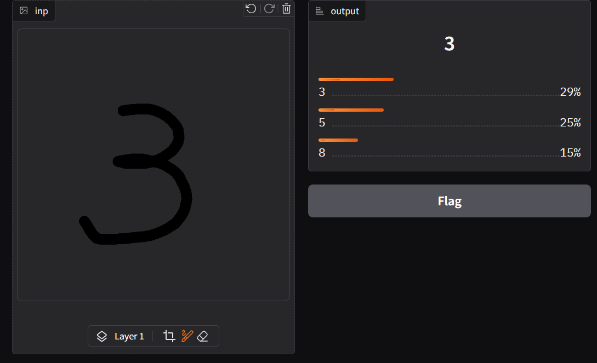
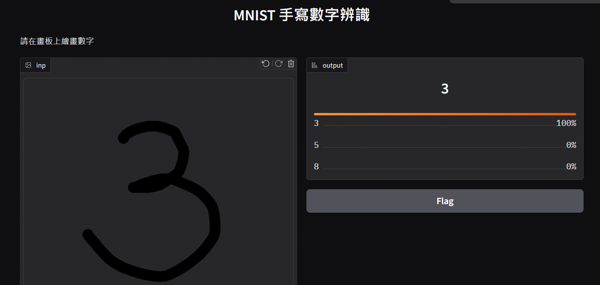

# 作業二

- 日期：2025/02/25
- 主題：打造自己的 DNN(全連結)手寫辨識

# Google Colab

- 連結：
  [-上課作業](https://colab.research.google.com/drive/1LAK8PpSQ1qoH9e7NRJLalNjHwL30VUTH?usp=sharing)
- 連結：
  [-上課筆記](https://colab.research.google.com/drive/1c5zAok7IQkd0WCugFMnYlaNeTulDmh1F?usp=sharing)

在筆記中，寫下 3 後，便是還沒有完全確定這個手寫數字就是 3

經過訓練後，完全確定就是 3 ~可喜可賀
直接提高了 70%的準確率

